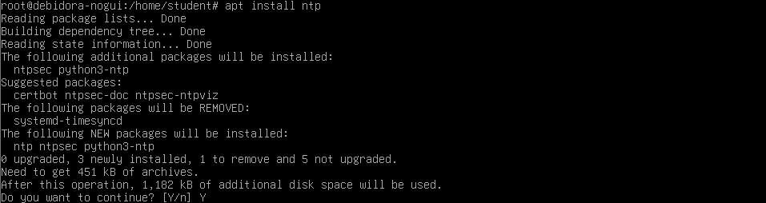

# NTP dan Samba

## NTP

1. Install NTP

```bash
apt install ntp
```



1. Lihat pool address server ntp indonesia di [https://www.ntppool.org/en/zone/id](https://www.ntppool.org/en/zone/id)


1. Pindah ke direktori **/etc/ntpsec** dan edit konfigurasi file ntp.conf

```bash
cd /etc/ntpsec
nano ntp.conf
```


Berikan comment untuk default pool adress, lalu tambahkan pool address indonesia

```bash
server 0.id.pool.ntp.org
server 1.id.pool.ntp.org
server 2.id.pool.ntp.org
server 3.id.pool.ntp.org
```

1. Restart service ntp dan cek statusnya 

```bash
systemctl restart ntp
systemctl status ntp
```


1. Periksa hasil konfigurasi ntp

```bash
ntpq -p
```


Dengan ini, maka ntp sudah sesuai dengan waktu di Indonesia

## Samba

1. Install Samba Server

```bash
ntpq -p
```


1. Buat direktori baru dengan nama **share** pada direktori /**home** dan ubah mode aksesnya untuk mengizinkan semua akses dengan perintah chmod

```bash
cd home
mkdir share
chmod 777 share
```


Setelah mengizinkan akses, cek kembali izin akses nya

```bash
ls -l
```


1. Cek IP Address yang digunakan debian

```bash
ip a
```


1. Masuk ke direktori **/etc/samba** dan konfgiurasi file **smb.conf**

```bash
cd /etc/samba
nano smb.conf
```


Tambahkan **unix charset = UTF-8,** uncomment pada bagian **interfaces** dan tambahkan IP network dari IP address pada server atau IP yang digunakan pada debian


Tambahkan definisi untuk **share** folder seperti gambar diatas

1. Restart samba service

```bash
systemctl restart smbd
systemctl status smbd
```


1. Connect ke **share** folder dari PC Client, sya menggunakan windows


1. Share folder pada samba server sudah dapat diakses dari client


1. Testing dengan menambahkan file melalui server, dan melihat di client


