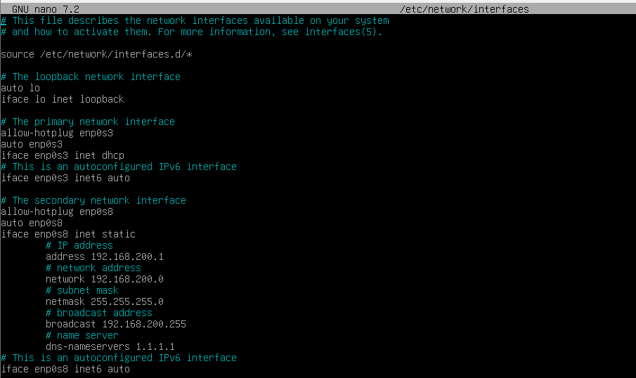

# DNS dan IP Forwarding

---

## Tujuan

Mengkonfigurasi jaringan yang melibatkan dua mesin virtual dengan pengaturan jaringan internal dan akses ke internet melalui bridge adapter. VM 1 berperan sebagai **gateway**, dengan alamat IP **192.168.200.1/24**, terhubung ke internet menggunakan bridge adapter sehingga dapat mengakses internet. VM 2 adalah **client** dengan alamat IP **192.168.200.22/24**, yang hanya terhubung ke VM 1 melalui jaringan internal. Dalam skenario ini, VM 2 tidak memiliki akses langsung ke internet, tetapi dapat mengaksesnya melalui VM 1 yang bertindak sebagai gateway dengan IP Forwarding.

---

## Konfigurasi VM 1

### [1] Install Aplikasi yang dibutuhkan

Install bind9 untuk DNS server

```bash
sudo apt install bind9 bind9utils
```

Install iptables untuk Routing Tables

```bash
sudo apt install iptables
```

### [2] Konfigurasi IP Address

Edit IP address pada VM 1 melalui 

```bash
sudo nano /etc/network/interfaces
```



- **enp0s3** merupakan network interface primary yang kita hubungkan ke bridge adapter, konfigurasi ini akan kita biarkan default untuk menerima IP address sebagai DHCP client
- **enp0s8** merupakan interface secondary yang terhubung ke internal network yang nantinya akan dihubungkan ke VM 2, konfigurasi ini kita beri IP statis di **192.168.200.1/24**

### [3] Konfigurasi DNS

Masuk ke direktori `/etc/bind`**,** pada folder ini kita akan mengkonfigurasi dan membuat beberapa file baru

1. **named.conf**

```bash
sudo nano /etc/network/interfaces
```


tambahkan line `include "/etc/bind/named.conf.external-zones"` untuk menambahkan zones yang nantinya akan kita buat

1. **named.conf.options**

```bash
sudo nano /etc/network/interfaces
```


Tambahkan line berikut

```bash
allow-query { any; };
allow-transfer { any; };
recursion yes;
```

1. **named.conf.external-zones**

```bash
sudo nano named.conf.external-zones
```


Disini kita membuat zones untuk DNS kita, terdapat 2 zone dimana satu untuk nameserver yaitu **kelompok9.com** dan satu lagi untuk IP [**1.200.168.192.in-addr.arpa](http://1.200.168.192.in-addr.arpa).**

1. **kelompok9.com (zone file)**

```bash
sudo nano kelompok9.com
```


1. **1.200.168.192.db (zone file)**


Setelah itu semua kita konfigurasi , kita cek terlebih dahulu apakah konfigurasi yang sudah kita buat sudah benar atau belum

```bash
named-checkzone [nama_zone] [file_konfigurasi_zone]
```


Setelah semua sudah **OK,** restart **named.service** untuk menerapkan konfigurasi tersebut

```bash
sudo systemctl restart named
```

### [4] Set IP Forwarding

Ubah nilai ip_forward menjadi 1 sehingga VM 1 dapat meneruskan IP 

```bash
echo 1 > /proc/sys/net/ipv4/ip_forward
```


Selanjutnya konfigurasi iptables

```bash
sudo iptables -t nat -A POSTROUTING -o enp0s3 -j MASQUERADE
```


Perintah ini berfungsi untuk menambahkan tabel NAT pada **iptables** dan melakukan **MASQUERADE** ke ip yang diteruskan ke interface **enp0s3 yang** terhubung ke internet. Ini akan mentranslasikan ip private ke ip public. Selanjutnya eksekusi perintah berikut 

```bash
sudo iptables -A FORWARD -i enp0s8 -o enp0s3 -j ACCEPT
sudo iptables -A FORWARD -i enp0s3 -o enp0s8 -j ACCEPT
```


Perintah ini akan menambahkan rules untuk meneruskan ip dari interface **enp0s8** ke **enp0s3** dan sebaliknya agar VM2 bisa terhubung ke internet.

Simpan konfigurasi tersebut dengan menggunakan

```bash
sudo iptables-save
```


---

## Konfigurasi VM2

Konfigurasikan IP STatic dari VM2 di halmaan setting address dengan address yang berada pada satu network dengan VM1 pada interface **enp0s8** yaitu **192.168.200.x**


## Testing

### Ping VM2 ke VM1 dan sebaliknya


### Cek Internet pada VM2


### Cek DNS VM1

```bash
dig www.kelompok9.com
```


```bash
dig -x 192.168.200.1
```


```bash
nslookup www.kelompok9.com
```


