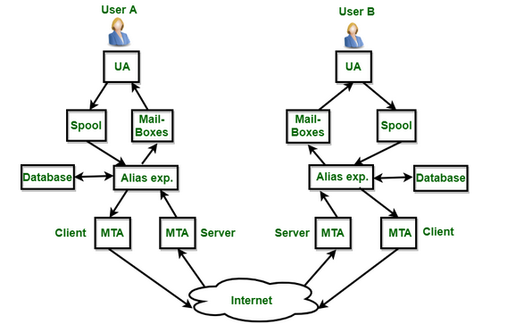

# Mail

Protokol email adalah aturan dan format standar yang digunakan oleh komputer dan server untuk mengirim, menerima, dan mengelola email. Berikut penjelasan rinci dan historis mengenai empat protokol utama yang biasa digunakan dalam sistem email:

## Mail Protocol

### Fungsi Protokol Email

| Fitur | Fungsi Utama | Arah Komunikasi |
| --- | --- | --- |
| SMTP | Mengirim Email | Client→Server |
| POP3 | Mengambil email dari server | Server → Client |
| IMAP | Sinkronisasi email dengan server | Dua arah |
| POP3S | POP3 + Enkripsi SSL/TLS | Aman, Server ➜ Client |

### Sejarah dan Urutan Perkembangan

| Tahun | Protokol | Peristiwa Utama |
| --- | --- | --- |
| 1982 | SMTP | Ditetapkan sebagai standar oleh RFC 821. Menggantikan metode awal pengiriman email berbasis FTP. |
| 1984 | POP | POP versi awal dirilis untuk mengambil email. |
| 1988 | POP3 | Versi ketiga dari POP dirilis sebagai RFC 1081. |
| 1990s | IMAP4 | Dikembangkan untuk mendukung akses email multi-perangkat. Finalisasi dengan RFC 2060. |
| ~2000s | POP3S | Implementasi POP3 menggunakan SSL/TLS untuk keamanan data. |

### Penjelasan Protocol

- SMTP (Simple Mail Transfer Protocol)
    
     SMTP adalah protokol utama yang digunakan untuk mengirim email dari pengirim ke server email tujuan, atau antar server email di internet. SMTP hanya berfungsi untuk mengirimkan pesan, bukan untuk menerima atau membaca email.
    
    Ketika seseorang menulis email di aplikasi email seperti Microsoft Outlook, Mozilla Thunderbird, atau Gmail, lalu menekan tombol “Send”, SMTP akan bekerja di belakang layar. Protokol ini mengambil pesan yang ditulis dan mengantarkannya ke server email penerima. Jika server penerima tidak bisa dijangkau secara langsung, SMTP akan meneruskan email itu melalui serangkaian server perantara sampai mencapai tujuan akhirnya.
    
    SMTP bekerja seperti tukang pos: ia tidak menyimpan surat (email), tetapi hanya mengantarkannya. SMTP menggunakan port 25 secara tradisional, namun kini port 587 (dengan STARTTLS) atau 465 (dengan SSL/TLS) lebih umum digunakan karena lebih aman.
    
- POP3 (Post Office Protocol Version 3)
    
    POP3 adalah protokol yang digunakan untuk mengambil email dari server dan menyalinnya ke perangkat pengguna (seperti laptop atau HP). Begitu email berhasil diunduh, biasanya salinannya akan dihapus dari server secara otomatis. POP3 biasanya berjalan di port 110.
    
    POP3 dirancang saat koneksi internet masih lambat dan mahal. Oleh karena itu, protokol ini dirancang agar pengguna bisa mengunduh seluruh email ke komputer lokal dan membaca/mengelolanya secara offline. Karena email disimpan di perangkat lokal, pengguna bisa membaca email meski tanpa koneksi internet.
    
    Namun, POP3 tidak mendukung sinkronisasi dua arah. Artinya, jika kamu membuka email dari satu perangkat, maka perangkat lain tidak tahu kalau email itu sudah dibaca atau dibalas. Ini membuat POP3 kurang cocok untuk pengguna modern yang mengakses email dari banyak perangkat (misalnya HP, laptop, dan tablet).
    
- IMAP (Internet Message Access Protocol)
    
    IMAP adalah protokol yang memungkinkan pengguna untuk mengakses email langsung dari server tanpa harus mengunduh dan menghapusnya. Berbeda dengan POP3, IMAP memungkinkan sinkronisasi dua arah antara server dan semua perangkat pengguna. IMAP berjalan pada port 143, atau port 993 jika menggunakan enkripsi SSL/TLS.
    
    Jika kamu menggunakan IMAP, maka saat kamu membaca, menghapus, atau memindahkan email ke folder tertentu, perubahan itu akan langsung tercermin di server. Ini berarti semua perangkat (HP, laptop, webmail) akan selalu menampilkan status email yang sama.
    
    IMAP sangat cocok di era cloud dan perangkat mobile. Misalnya, saat kamu membuka Gmail dari laptop, kamu bisa melihat email yang sama seperti yang muncul di aplikasi Gmail HP-mu, lengkap dengan folder, status terbaca, dan lain-lain.
    
- POP3S (POP3 Secure)
    
    POP3S adalah versi aman dari POP3. Fungsinya tetap sama: mengambil email dari server dan menyimpannya secara lokal. Namun, POP3S mengenkripsi komunikasi antara klien dan server menggunakan SSL (Secure Socket Layer) atau TLS (Transport Layer Security). POP3S biasanya menggunakan port 995.
    
    Dengan enkripsi ini, data sensitif seperti nama pengguna, kata sandi, dan isi email tidak dapat disadap oleh pihak ketiga saat melewati jaringan internet. POP3S biasanya digunakan oleh pengguna yang masih ingin memakai pendekatan pengambilan email ke lokal (seperti di POP3), tetapi dengan perlindungan tambahan.
    

### Perbandingan Karakter dan Penggunaan

| Fitur | SMTP | POP3 | POP3S | IMAP |
| --- | --- | --- | --- | --- |
| Fungsi utama | Kirim email | Ambil email | Ambil email | Sinkronisasi |
| Arah data | Keluar | Masuk | Masuk | Dua arah |
| Penyimpanan email | Tidak | Lokal | Lokal | Server |
| Cocok untuk multi-device | ❌ | ❌ | ❌ | ✅ |
| Aman (via SSL/TLS) | 465/587 (ya) | ❌ | ✅ | ✅ |
| Status email tersimpan | ❌ | ❌ | ❌ | ✅ |
| Ideal untuk pengguna | Pengirim | Pengguna offline | Pengguna offline (aman) | Pengguna aktif multi-device |

## Informasi Mail Server dalam Sebuah Domain

Informasi mail server dalam domain adalah data yang disimpan di sistem DNS (Domain Name System) yang mengatur bagaimana email dikirim ke dan dari domain tersebut, termasuk alamat server tujuan dan aturan keamanan email.

**Komponen Utama**

1. MX Record (Mail Exchanger)
Menentukan server mana yang menerima email untuk domain. Setiap MX record memiliki prioritas. Semakin kecil nilainya, semakin tinggi prioritasnya. Digunakan oleh server pengirim untuk mencari rute email.
2. A / AAAA Record
Digunakan untuk menerjemahkan hostname mail server (seperti mail.example.com) menjadi alamat IP (IPv4 untuk A, IPv6 untuk AAAA), agar dapat dihubungi melalui jaringan.
3. PTR Record (Reverse DNS)
Kebalikan dari A record, yaitu memetakan IP address ke hostname. Digunakan untuk memverifikasi identitas server pengirim. Tanpa ini, email berisiko dianggap spam oleh penerima.
4. SPF Record (Sender Policy Framework)
Catatan DNS jenis TXT yang menyatakan alamat IP atau server mana yang diizinkan mengirim email atas nama domain tersebut. Mencegah pemalsuan alamat pengirim (email spoofing).
5. DKIM Record (DomainKeys Identified Mail)
Berisi public key yang digunakan untuk memverifikasi tanda tangan digital dalam email. Membuktikan bahwa email tidak diubah selama perjalanan dari pengirim ke penerima.
6. DMARC Record (Domain-based Message Authentication, Reporting & Conformance)
Menetapkan kebijakan yang harus dilakukan penerima jika email gagal validasi SPF atau DKIM. Dapat diatur untuk hanya mengamati (none), karantina, atau menolak email.

**Alur Kerja Singkat**

- Server pengirim mencari MX record domain penerima untuk mengetahui ke mana email harus dikirim.
- Hostname dari MX diterjemahkan menjadi IP menggunakan A/AAAA record.
- Koneksi dibuat ke mail server tujuan menggunakan IP tersebut.
- Server penerima memverifikasi pengirim melalui SPF dan DKIM, lalu menerapkan aturan dari DMARC.
- Email diterima, ditandai sebagai spam, atau ditolak, tergantung hasil validasi.

**Tujuan**

- Menentukan dengan tepat server penerima email.
- Mencegah penyalahgunaan identitas domain pengirim.
- Meningkatkan reputasi dan keandalan pengiriman email.
- Memastikan email valid dan aman sebelum diterima pengguna.

## Introduction to Electric Mail

1. **User Agent**
User Agent adalah antarmuka pengguna email yang digunakan untuk menulis, membaca, dan mengelola pesan email.  Fungsi:
    - Membuat dan mengirim email (komposer).
    - Mengakses email yang masuk dari Mailbox.
    - Menghapus, membalas, atau meneruskan email.
        
        Contoh: Gmail, Outlook, Thunderbird, Apple Mail.
        
2. **Mailboxes**
Mailboxes adalah tempat penyimpanan permanen untuk email yang telah diterima oleh pengguna. Fungsi:
    - Menyimpan email masuk yang sudah dikirim dari MTA penerima.
    - Dapat terorganisir dalam folder seperti Inbox, Sent, Drafts, Spam, Trash.
    - Diakses oleh UA untuk menampilkan isi email ke pengguna.
3. **Spool**
Spool adalah area penyimpanan sementara untuk email yang sedang menunggu diproses atau dikirim. Fungsi:
    - Menyimpan email sebelum dikirim oleh MTA.
    - Menyimpan email yang tertunda pengiriman karena koneksi ke tujuan belum tersedia.
    - Bersifat antrian kerja (queue) bagi sistem email.
4. **Alias Expander**
Komponen yang bertugas menerjemahkan alias atau nama pendek menjadi alamat email sebenarnya. Fungsi:
    - Jika email dikirim ke alamat alias (contoh: support@domain.com), akan diperluas menjadi beberapa alamat seperti agus@, rina@.
    - Mendukung pengiriman ke grup pengguna tanpa harus mengetik semua alamat manual.
    - Membaca dari database alias atau konfigurasi statis.
5. **Database**
Database menyimpan data yang digunakan oleh sistem email untuk berbagai proses internal. Fungsi:
    - Menyimpan informasi pengguna, akun email, konfigurasi alias, daftar penerima, dsb.
    - Mendukung proses validasi alamat, pencocokan alias, otentikasi pengguna, dan pengelolaan kuota.
6. **Mail Transfer Agent**
    
    Program yang menangani pengiriman email dari satu server ke server lain melalui internet.
    
    Fungsi:
    
    - Menerima email dari UA atau spool untuk dikirim ke tujuan.
    - Melakukan koneksi SMTP ke MTA penerima.
    - Menyimpan log pengiriman dan menangani kegagalan pengiriman.
        
        Contoh: Sendmail, Postfix, Exim, qmail.
        
        Peran:
        
    - MTA Client: mengirimkan email ke internet.
    - MTA Server: menerima email dari internet.
7. **Internet**
Jaringan global yang menjadi media perantara komunikasi antar server email.  Fungsi:
    - Menghubungkan MTA pengirim dan penerima.
    - Menyalurkan email dari satu domain ke domain lain.
    - Media transport utama dalam sistem email global.

Setiap komponen bekerja dalam alur berantai untuk menjamin pengiriman email dari pengirim ke penerima dengan benar, aman, dan terstruktur. UA menangani interaksi pengguna, MTA mengelola transportasi email, spool dan mailbox menangani penyimpanan, alias expander dan database membantu dalam rute dan pengelolaan alamat, sedangkan internet menghubungkan seluruh sistem antar server di berbagai lokasi.
